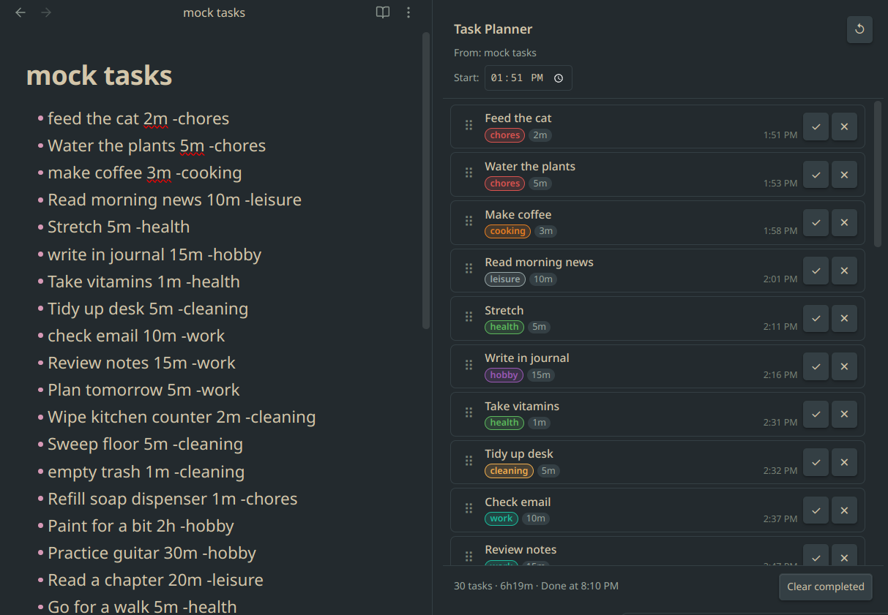

# Autism Task Planner



A sidebar panel for Obsidian that turns your markdown task list into a sequenced schedule — with live time estimates, drag-and-drop reordering, and category labels. Built for people who need to see exactly what comes next and how long everything will take.

---

## How it works

Open any note that contains a task list, then run **Open Task Planner** from the command palette. The panel reads your list and displays every task as a card with a calculated start time based on how long everything before it takes.

Reorder cards by dragging. Edit a duration by clicking it. Change a category by clicking the label. Mark tasks done as you go. The schedule updates instantly every time.

---

## Task list format

Write tasks in any markdown note using this format:

```
- Task name 5m -category
- Another task 1h30m -category
```

| Part | Format | Examples |
|------|--------|---------|
| Task name | Any text | `brush teeth`, `Record video` |
| Duration | `Nm`, `Nh`, or `NhMm` | `5m`, `2h`, `1h30m` |
| Category | `-word` at the end | `-health`, `-work`, `-hobby` |

Capitalization and trailing spaces are preserved exactly as written. A line with no duration defaults to 0m. A line with no category tag is labelled `other`.

---

## Features

**Time planning**
- Set a custom start time at the top of the panel, or let it default to right now
- Every card shows its calculated start time based on all tasks before it
- Footer shows total duration and estimated finish time
- All times use your local timezone

**Reordering**
- Drag any card to a new position
- All start times downstream recalculate immediately

**Editing**
- Click a duration badge to edit it inline (`5m`, `1h`, `1h30m`, `90m`, or a plain number of minutes)
- Click a category badge to pick a new category from a dropdown

**Completing tasks**
- Check off a task — it dims and moves out of the active schedule
- Click the undo arrow to bring it back
- "Clear completed" removes all done tasks at once

**Syncing back to your file** *(optional, off by default)*
- Completions can be written back as `- [x] ...` checkboxes
- Reorders can be written back to the file in the new order
- Edited durations and categories can be written back inline

The file is **never touched** unless you explicitly enable a sync setting.

---

## Built-in categories

| Category | | Category | |
|----------|--|----------|--|
| `hygiene` | blue | `work` | teal |
| `grooming` | slate blue | `cooking` | orange |
| `health` | green | `exercise` | forest green |
| `cleaning` | amber | `social` | pink |
| `chores` | red | `errands` | brown |
| `hobby` | purple | `finance` | cyan |
| `other` | gray | `learning` | indigo |
| | | `creative` | deep orange |
| | | `selfcare` | rose |
| | | `family` | amber-gold |

Category colors can be changed per-category in **Settings → Autism Task Planner**.

---

## Settings

| Setting | Default | Description |
|---------|---------|-------------|
| Default start time | Current time | Set a fixed start time (e.g. `09:00`) or leave blank to use now |
| Sync reorder to file | Off | Writes the new task order back to the markdown file after dragging |
| Sync completions to file | Off | Marks completed tasks as `- [x] ...` in the file |
| Sync edited durations/categories to file | Off | Writes duration and category edits back inline |
| Category colors | Per built-in defaults | One color picker per category |

---

## Installation

### Via BRAT (recommended for early access)

1. Install [BRAT](https://github.com/TfTHacker/obsidian42-brat) from the Community Plugins browser
2. Open BRAT settings → **Add Beta Plugin**
3. Paste: `mm0x1/obsidian-autism-task-planner`

### Via Community Plugins

Search for **Autism Task Planner** in Settings → Community plugins → Browse.

### Manual

1. Download `main.js`, `manifest.json`, and `styles.css` from the [latest release](https://github.com/mm0x1/obsidian-autism-task-planner/releases/latest)
2. Copy them into `.obsidian/plugins/obsidian-autism-task-planner/` inside your vault
3. Enable the plugin in Settings → Community plugins
